## GDP per capita and Venues Data Analysis of California

#### 1. Introduction

##### 1.1 Business Problem

​       California is the largest sub-national economy in the world, with 39.5 million residents across a total area of about 163,696 square miles (423,970 km2)[1]. As California is so big, people‘s income and consumption level could diverse from city to city. When we think of it by the investor, they prefer the city where the type of business they want to install is less intense, while the consumer's  income match the product price. If we think of the residents, they would like to choose those city with higher GDP per capita, which means higher income, and variety of shop venues. 

##### 1.2 Data 

* US government reported GDP per capita of county[2]. I cleaned the data and reduced it to California where I want to analysis.
* I used **Forsquare API**[3] to get the most common venues of given county of California.
* I used google search to get the center coordinates of each county
* I got geojson of California from click_that_hood on Github[4]

#### 2. Methodology

I extracted data of California from the whole GDP per capita data , then combined it with coordinates data.

result dataframe looks like below. 

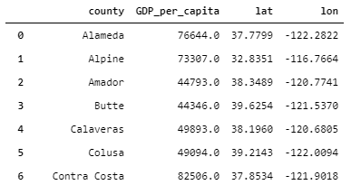

I examined that what was the frequency of personal income in different ranges, then plot a histogram to visualize as below.

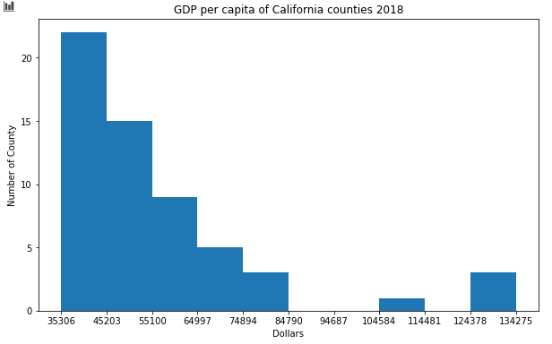

I used library Folium to create a choropleth map to visualize the level of personal income over the  California.

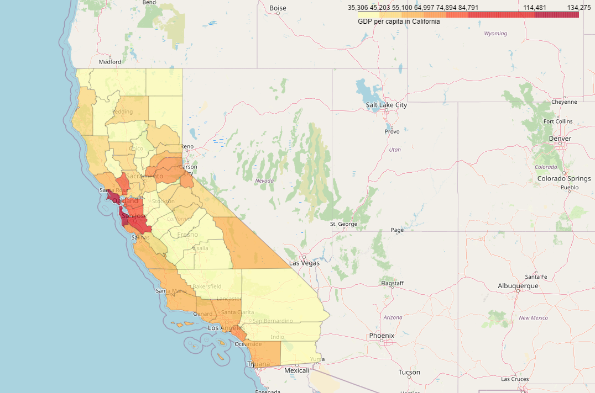

I leveraged Foursquare API to get Venues data around each county, for the sake of big area, I set the radius to 10km.And it resulted like below.

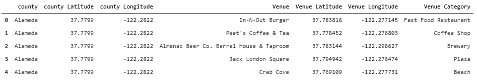

I counted the results. As the graph below show, approximately third of all counties get 100 returned results. For the sake of big area and limit of Foursquare API Calls, it's hard to get all venues.

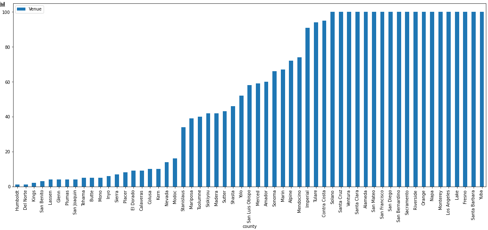

In summary of results Foursquare returned, I created a table showing top 10 category of venues of each county as below.

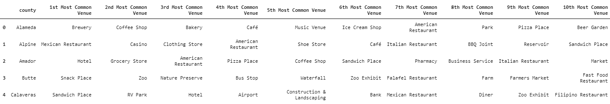

We have some common venue categories in boroughs. In this reason I used k-means to cluster the counties. K-Means algorithm is one of the most common and fast cluster method. 

And I used Elbow method to select the optimal K=7.

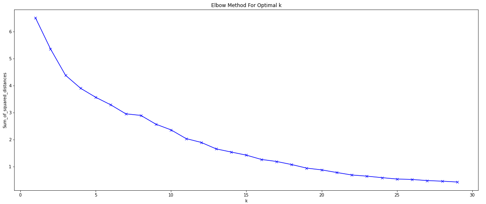

Then I merged cluster label, top 10 venues with origin table.

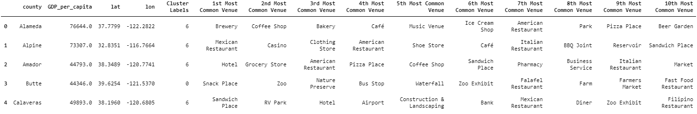

I examined the number of 1st Most Common Venue in each cluster.

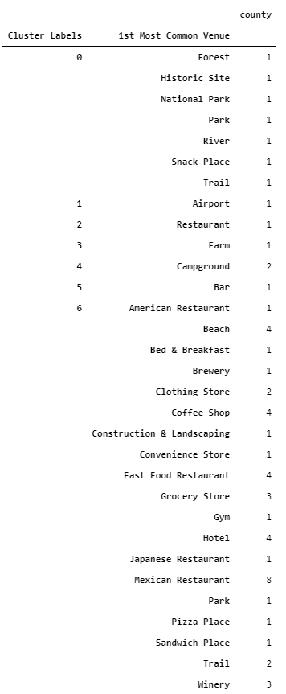

Then I defined each cluster as follows:

* Cluster 0 : “Tourist county”
* Cluster 1 : “Transport County”
* Cluster 2 : “Catering County”
* Cluster 3 : “Agricultural County”
* Cluster 4 : “Camp County”
* Cluster 5 : “Beverage County”
* Cluster 6 : “Comprehensive County”

And labeled consuming ability as below:

* 35306.0-45202.9 Low-1 Level

* 45202.9-55099.8 Low-2 Level
* 55099.8-64996.7 Mid-1 Level
* 64996.7-74893.6 Mid-2 Level
* 74893.6-84790.5 Mid-3 Level
* 84790.5-114481.2 High-1 Level
* 114481.2-134275.0 High-2 Level

#### 3. Results

Finally, I merged those labels with origin dataframe.

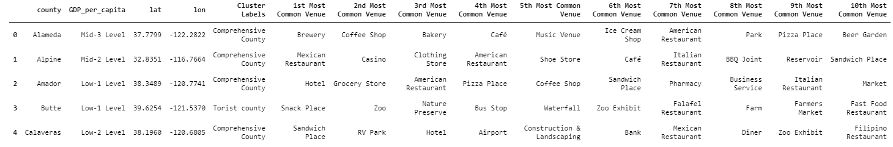

And visualized it as choropleth map with cluster labels superimposed on it.

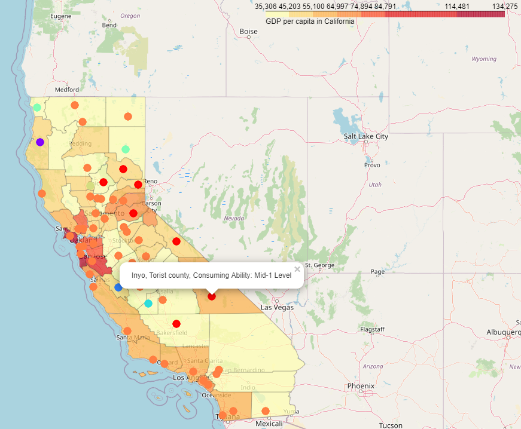

#### 4. Discussion

Our analysis show that counties around Bay Area have highest personal income among whole state, while those counties almost are comprehensive counties, which means they have mature commercial environment. While counties near west coast have relatively higher personal income than those away from coast. Those counties around Sierra Nevada mountains tend to be a tourist county or camp county.

For workers, they could choose those counties near west coast, which have higher personal income and more comprehensive services. Those prefer to be close to hot spot, EI Dorado or Inyo would be nice choice.

For investors, they could also choose those counties near west coast, because of higher consuming ability. While those investors want to sale tourist/camp product, counties away from west coast would be a better choice.

#### 5. Conclusion

In this project, I analyzed type and personal income of counties in California. I used K-means to divide counties into 7 clusters(optimal K chosen by Elbow method), and combined with GDP per capita data. Finally, people could choose counties where they want to work or invest basing on those labels.

#### References:

[1] https://en.wikipedia.org/wiki/California
[2] https://www.bea.gov/data/income-saving/personal-income-county-metro-and-other-areas
[3] https://developer.foursquare.com/docs/places-api/
[4] https://raw.githubusercontent.com/codeforamerica/click_that_hood/master/public/data/california-counties.geojson